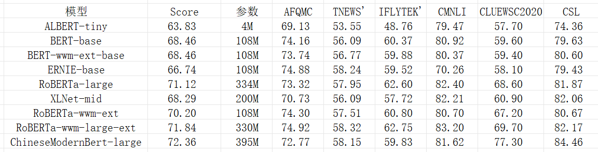
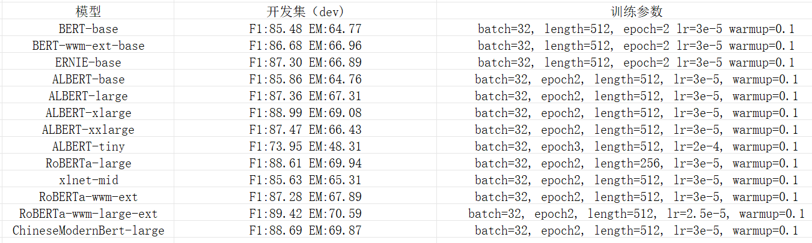

# ChineseModernBert-Fintune
使用ChineseModernBert进行下游任务微调。

# 安装环境

`pip install -r requirements.txt`

# 微调分类任务

```shell
cd classifier_pytorch

# 下载数据集
python download_clue_data.py --data_dir=./CLUEdatasets --tasks=all
# 注意对于数据集cmnli，ocnli下载完成后需要将*.json从*_public移动到上一级目录下

# 直接运行对应任务sh脚本，如
bash run_classifier_tnews.sh

# 需要注意修改MODEL_NAME，也就是下载的ChineseModernBert的路径
```

结果：



# 微调阅读理解任务

目前只支持mrc2018数据集，也就是QA问答，不支持multichoice。

```shell
cd mrc_pytorch

# 第一次运行指令，会下载数据集，需要将mrc_data/CMRC2018/下面数据重命名为train.json、dev.json、test.json
bash run_mrc_cmrc2018.sh

# 然后再此运行进行训练
bash run_mrc_cmrc2018.sh

# 需要注意修改BERT_DIR为下载的模型路径，以及训练时的gpu_ids(根据使用的显卡而定)
```

结果：



# 感谢

> https://github.com/CLUEbenchmark/CLUE/
>
> [enze5088/ChineseModernBert: 中文预训练ModernBert](https://github.com/enze5088/ChineseModernBert)
